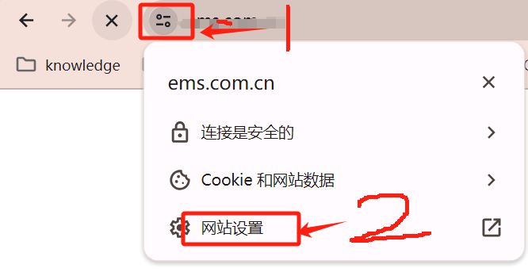
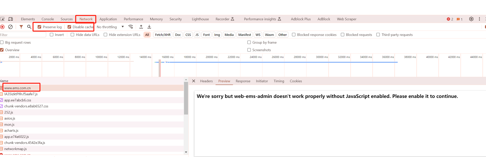
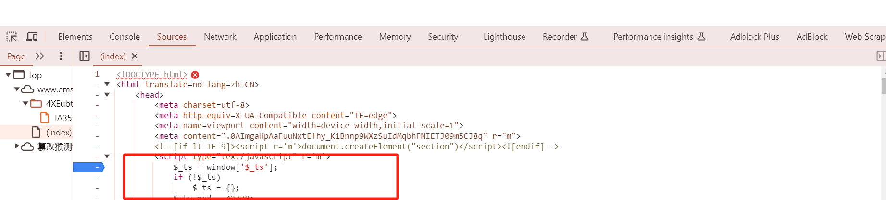
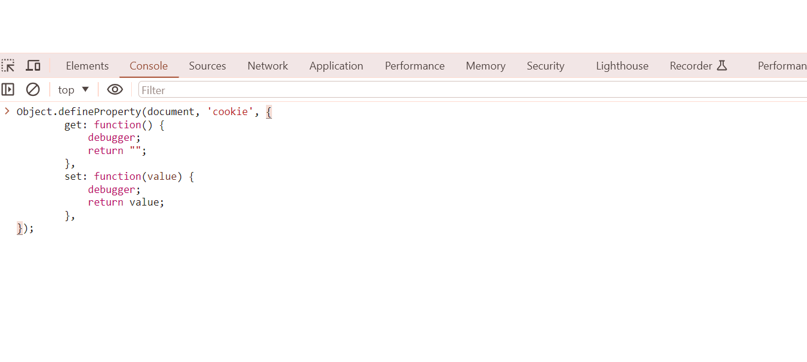
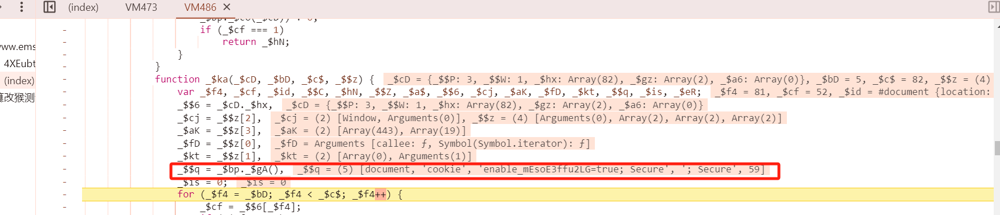

#  hook网站cookie步骤详解
## 前言
    小白，想要爬取目标网站：aHR0cHM6Ly93d3cuZW1zLmNvbS5jbi8= <br>
    但是不想要用selenium等图形化方式，就开始研究怎么通过接口方式获取信息。
    但是网上一些教程对纯小白来说还是太高深了，hook很多都是一笔带过，这边试验过后，记录下前期的一些基础操作

## hook脚本
```javascript
// 定义 hook 脚本，这样，代码读写cookie的时候，就会断点停下来，方便分析了
Object.defineProperty(document, 'cookie', {
        get: function() {
            debugger;
            return "";
        },
        set: function(value) {
            debugger;
            return value;
        },
});
```

## 插入过程
1. 清空目标网站 cookie<br> <br>  > 算了，不打码了
2. 在目标网站界面，按F12打开network, 选中Preserve log, 保留每个请求<br><br>找到第一个请求, 右键点击open in sources panel, 在源码顶端加上断点<br>
3. 在初始界面打上断点后，回到Cosole, 粘贴hook脚本<br>
4. 继续运行, 成功找到设置cookie的位置<br>

## TODO 继续分析
再往后貌似抠代码了，学习中...